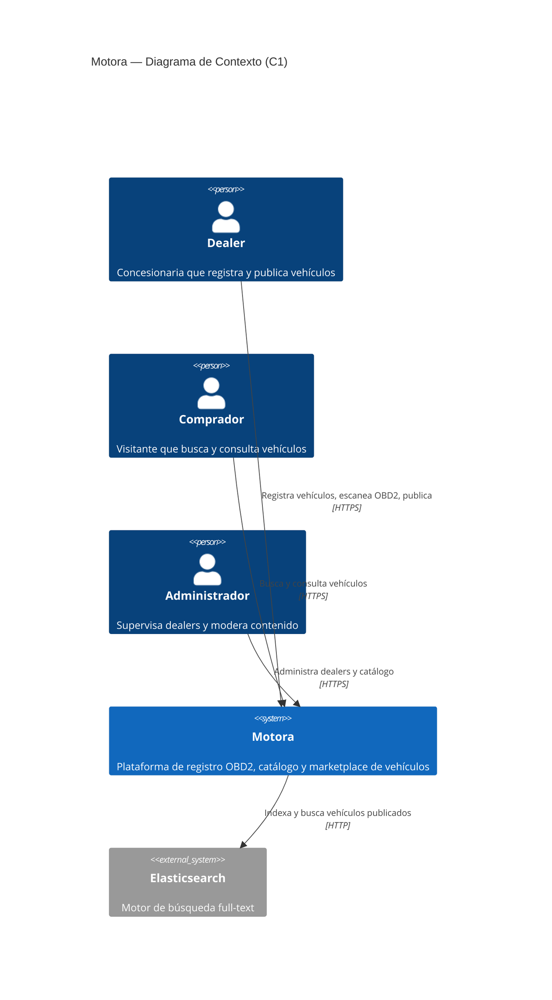
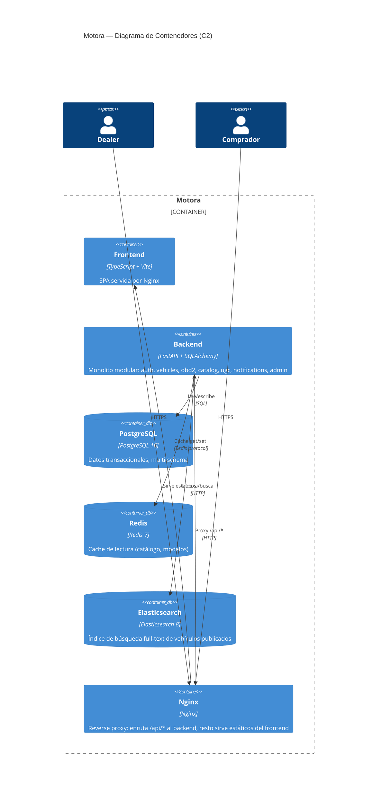
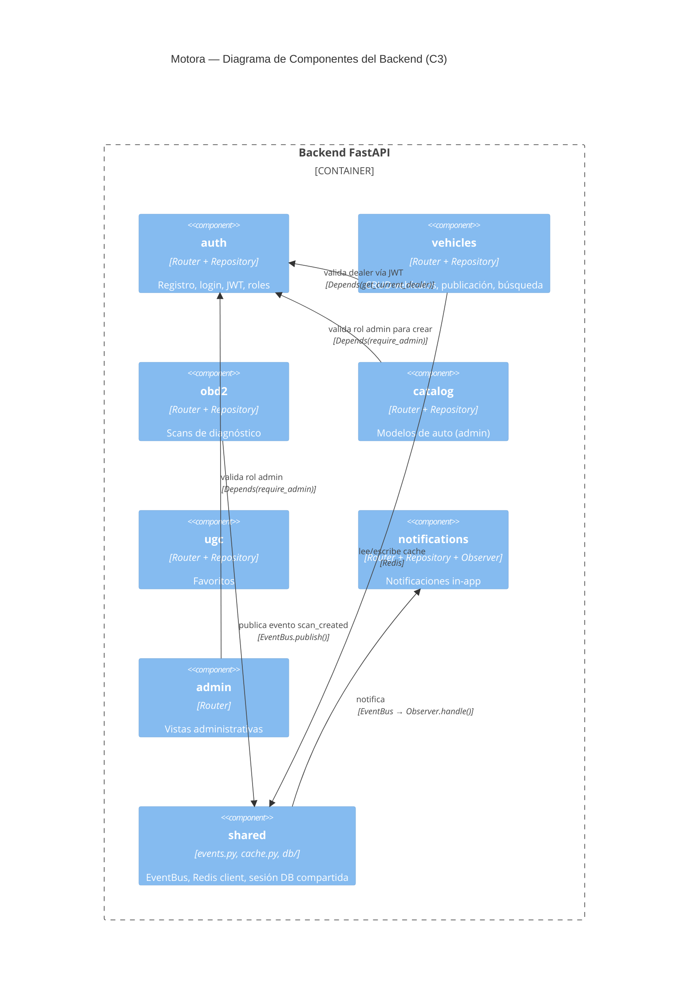

# Diagramas C4 — Motora

## C1 — Diagrama de Contexto

```mermaid
C4Context
title Motora — Diagrama de Contexto (C1)

Person(dealer, "Dealer", "Concesionaria que registra y publica vehículos")
Person(buyer, "Comprador", "Visitante que busca y consulta vehículos")
Person(admin, "Administrador", "Supervisa dealers y modera contenido")

System(motora, "Motora", "Plataforma de registro OBD2, catálogo y marketplace de vehículos")

System_Ext(es, "Elasticsearch", "Motor de búsqueda full-text")

Rel(dealer, motora, "Registra vehículos, escanea OBD2, publica", "HTTPS")
Rel(buyer, motora, "Busca y consulta vehículos", "HTTPS")
Rel(admin, motora, "Administra dealers y catálogo", "HTTPS")
Rel(motora, es, "Indexa y busca vehículos publicados", "HTTP")
```

## C2 — Diagrama de Contenedores

```mermaid
C4Container
title Motora — Diagrama de Contenedores (C2)

Person(dealer, "Dealer")
Person(buyer, "Comprador")

Container_Boundary(motora, "Motora") {
  Container(frontend, "Frontend", "TypeScript + Vite", "SPA servida por Nginx")
  Container(backend, "Backend", "FastAPI + SQLAlchemy", "Monolito modular: auth, vehicles, obd2, catalog, ugc, notifications, admin")
  ContainerDb(postgres, "PostgreSQL", "PostgreSQL 16", "Datos transaccionales, multi-schema")
  ContainerDb(redis, "Redis", "Redis 7", "Cache de lectura (catálogo, modelos)")
  ContainerDb(es, "Elasticsearch", "Elasticsearch 8", "Índice de búsqueda full-text de vehículos publicados")
  Container(nginx, "Nginx", "Nginx", "Reverse proxy: enruta /api/* al backend, resto sirve estáticos del frontend")
}

Rel(dealer, nginx, "HTTPS")
Rel(buyer, nginx, "HTTPS")
Rel(nginx, frontend, "Sirve estáticos")
Rel(nginx, backend, "Proxy /api/*", "HTTP")
Rel(backend, postgres, "Lee/escribe", "SQL")
Rel(backend, redis, "Cache get/set", "Redis protocol")
Rel(backend, es, "Indexa/busca", "HTTP")
```

## C3 — Diagrama de Componentes (dentro del Backend)

```mermaid
C4Component
title Motora — Diagrama de Componentes del Backend (C3)

Container_Boundary(backend, "Backend FastAPI") {
  Component(auth, "auth", "Router + Repository", "Registro, login, JWT, roles")
  Component(vehicles, "vehicles", "Router + Repository", "CRUD vehículos, publicación, búsqueda")
  Component(obd2, "obd2", "Router + Repository", "Scans de diagnóstico")
  Component(catalog, "catalog", "Router + Repository", "Modelos de auto (admin)")
  Component(ugc, "ugc", "Router + Repository", "Favoritos")
  Component(notifications, "notifications", "Router + Repository + Observer", "Notificaciones in-app")
  Component(admin, "admin", "Router", "Vistas administrativas")
  Component(shared, "shared", "events.py, cache.py, db/", "EventBus, Redis client, sesión DB compartida")
}

Rel(obd2, shared, "publica evento scan_created", "EventBus.publish()")
Rel(shared, notifications, "notifica", "EventBus → Observer.handle()")
Rel(vehicles, auth, "valida dealer vía JWT", "Depends(get_current_dealer)")
Rel(admin, auth, "valida rol admin", "Depends(require_admin)")
Rel(vehicles, shared, "lee/escribe cache", "Redis")
Rel(catalog, auth, "valida rol admin para crear", "Depends(require_admin)")
```
